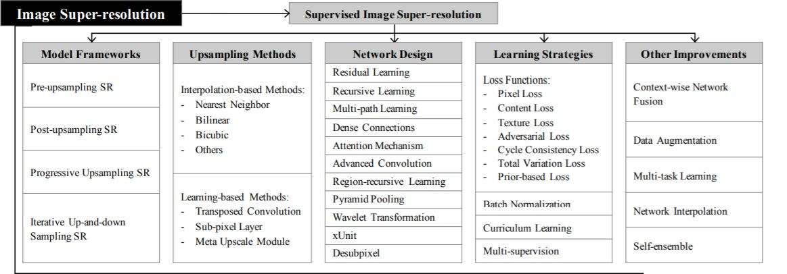
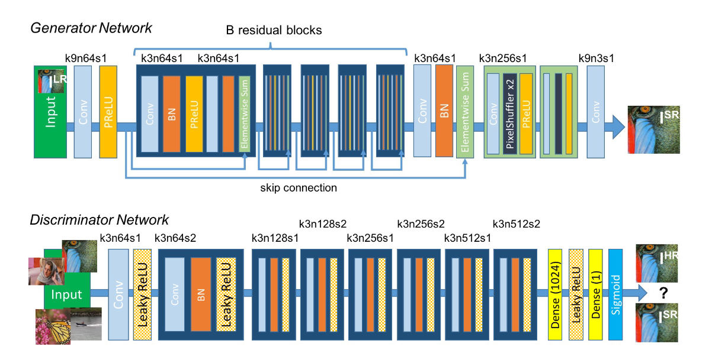
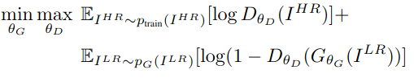
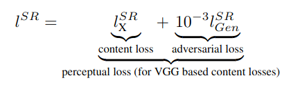
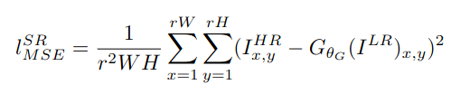
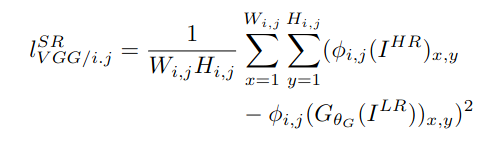
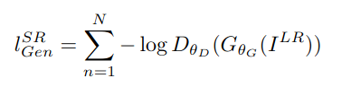
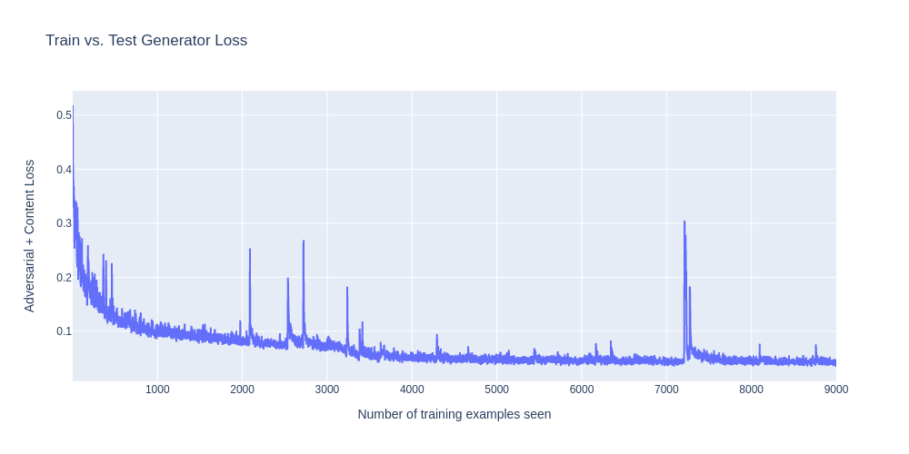
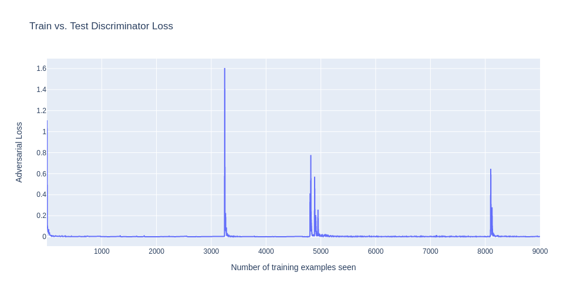

# Image Super-Resolution

## Approach

For this task I have used <b>SRGAN</b> (Super-Resolution Generative Adversarial Network) which uses the idea of GAN for super-resolution task i.e. generator will try to produce an image from noise which will be judged by the discriminator. Both will keep training so that generator can generate images that can match the true training data.

Dataset with high and low resolution images were provided.

1. Since the dataset had two different subfolders containing HR and LR images, I have first mapped the LR images to their corresponding HR images and then divided them into train and test folders.
2. Images were in .npy format, so it was converted to .jpg by using opencv.
3. The architecture for the model is defined. First the feature extractor is defined which is used for perceptual loss as this model works on comparing the feature maps formed by the VGG model.
4. Then Generator and Discriminator blocks are defined. Generator is a deconvolutional block which upsamples the image while Discriminator is a convolutional block which downsamples the image.
5. The output from the generator block is fed to the discriminator block.
6. Generator job is to create a real image while the Discriminator job is to detect whether the input image from the generator is a real or fake image.
7. The model is trained for 1 epoch.
8. MSE, PSNR and SSIM are calculated after training.

## THEORY

- Image super-resolution (SR) is the process of recovering high-resolution (HR) images from low-resolution (LR) images.
- It is an important class of image processing techniques in computer vision and image processing and enjoys a wide range of real-world applications, such as medical imaging, satellite imaging, surveillance and security, astronomical imaging, amongst others.
- With the advancement in deep learning techniques in recent years, deep learning-based SR models have been actively explored and often achieve state-of-the-art performance on various benchmarks of SR.
- A variety of deep learning methods have been applied to solve SR tasks, ranging from the early Convolutional Neural Networks (CNN) based method to recent promising Generative Adversarial Nets based SR approaches.

- Image super-resolution (SR) problem, particularly single image super-resolution (SISR), has gained a lot of attention in the research community.
- SISR aims to reconstruct a high-resolution image ISR from a single low-resolution image ILR.
- Generally, the relationship between ILR and the original high-resolution image IHR can vary depending on the situation. Many studies assume that ILR is a bicubic downsampled version of IHR, but other degrading factors such as blur, decimation, or noise can also be considered for practical applications.

<b>Exhaustive table of topics in Supervised Image Super-Resolution:</b>

## SRGAN(Super resolution Generative Adversarial Network)

- The algorithm uses a deep <b>residual network (ResNet)</b> with <b>skip connections</b> and diverges from the mean squared error (MSE) as the sole optimization target.
- Instead of relying solely on the MSE, the algorithm defines a novel perceptual loss that uses high-level feature maps of the VGG network in combination with a discriminator to encourage solutions that are perceptually difficult to distinguish from the high-resolution (HR) reference images.
- This approach improves the perceptual quality of the reconstructed images and results in more natural-looking textures and structures.
- By using the VGG model’s high-level feature maps in the perceptual loss, the SRGAN algorithm is able to capture the semantic content of the images and encourage the reconstruction of visually similar features.
- The discriminator, on the other hand, is a component of a generative adversarial network (GAN) that is used to distinguish between real and fake images.
- In the context of SRGAN, the discriminator is trained to distinguish between the HR reference images and the reconstructed images produced by the generator network.
- By encouraging the reconstructed images to be perceptually difficult to distinguish from the HR images, the SRGAN algorithm is able to produce high-quality SR results that are visually appealing and indistinguishable from the HR reference images.
- Prediction-based methods were among the first methods developed to tackle single-image super-resolution (SISR).
- These methods use filtering approaches such as linear, bicubic, or Lanczos filtering to upscale an image to a higher resolution.
- These methods are often fast, but they oversimplify the SISR problem and tend to produce solutions with overly smooth textures.
- This is because these methods only use local information to make their predictions and do not consider global image features or structures.
- On the other hand, edge-preservation methods focus on preserving the edges and sharp features of the image during the upscaling process.
- These methods aim to produce SR images with more natural-looking textures and structures.
- Edge-preservation methods often use more complex algorithms, such as super-resolution using sparse representation (SRSR), iterative back-projection (IBP), and total variation (TV) regularization.
- These methods typically take longer to compute than prediction-based methods, but they are more effective at preserving the details and structures of the original image.
- The main advantage of SRGAN over prediction-based methods is its ability to learn the mapping between low-resolution and high-resolution images from a large dataset.
- This allows the model to capture the complex patterns and structures of the high-resolution images and generate more realistic and detailed results.
- Moreover, SRGAN produces sharper and more realistic edges and textures compared to prediction-based methods, thanks to the adversarial loss function used in its training process.
- In SISR, the goal is to generate a high-resolution image (ISR) from a low-resolution image (ILR) where the high-resolution images are only available during the training process. To generate ILR from IHR, a Gaussian filter is applied to IHR followed by a downsampling operation with a downsampling factor r.
- Here, W and H denote the width and height of the image, respectively, and C represents the number of color channels. Therefore, the size of the ILR tensor is W x H x C, while the size of the IHR and ISR tensors is rW x rH x C. The goal of the SISR algorithm is to estimate the ISR tensor from the ILR tensor.
- The aim is to train a generator network that can estimate a high-resolution (HR) image from a given low-resolution (LR) image.
- The generator network is a feed-forward convolutional neural network (CNN) that is parametrized by θG, which includes the weights and biases of an L-layer deep network.
- The network is trained to optimize a SR-specific loss function, denoted by lSR, using a set of training images InHR and corresponding low-resolution images InLR, where n = 1, . . . , N.
- The objective is to minimize the average of lSR over all the training samples to obtain the optimal parameter values θG that can be used for super-resolution.

### Use of Discriminator network (DθD)

The discriminator is optimized along with the generator network GθG to solve the adversarial min-max problem. The goal is to train a generative model G that can fool the discriminator D, which is trained to distinguish super-resolved images from real images. By doing so, the generator can learn to create solutions that are highly similar to real images and difficult to classify by D, which encourages perceptually superior solutions residing in the subspace, or manifold, of natural images. This approach is in contrast to using pixel-wise error measurements, such as MSE, to obtain SR solutions.

### Perceptual Loss function

### Content Loss

- This is the most widely used optimization technique for image SR. But as explained in the previous section, this method produces overly smooth images and often lacks high frequency elements.
- Instead of using MSE loss, we instead use VGG loss.
- The VGG loss used in the SRGAN is based on the ReLU activation layers of the pre-trained 19-layer VGG network. - Let φi,j denote the feature map obtained by the j-th convolution (after activation) before the i-th max-pooling layer within the VGG19 network. Then, the VGG loss is defined as the Euclidean distance between the feature representations of a reconstructed image GθG (ILR) and the reference image IHR:

where i and j denote the layer and channel indices, and C, H, and W denote the number of channels, height, and width of the feature map, respectively. The VGG loss is calculated for multiple layers of the VGG network to capture both high-level and low-level features of the image. By using the VGG loss, the SRGAN can produce visually pleasing super-resolved images that are perceptually similar to the high-resolution reference images, rather than simply minimizing pixel-wise errors.

### Adversarial Loss

- In addition to the content loss, adversarial loss is also added to the perceptual loss.
- This loss encourages the generator network to produce images that have a high probability of being classified as real by the discriminator network.
- By incorporating this loss into the overall objective function, the generator network is trained to produce super-resolved images that not only have low perceptual differences with the ground truth images but also have high visual quality and naturalness.

#### Metrics

1. <b>MSE Loss</b>

MSE measures the average squared difference between the generated HR image and the ground truth HR image. To calculate the MSE for a set of N test images, we can use the following equation:

$MSE = (1/N)$ \* $\Sigma[(HR_i - GAN_i)^2]$

Here, $HR_i$ is the ground truth HR image, $GAN_i$ is the corresponding generated HR image by the SRGAN model, and the sum is taken over all N test images.

2. <b>SSIM (Structural Similarity Index)</b>

SSIM measures the structural similarity between the generated HR image and the ground truth HR image. To calculate the SSIM for a set of N test images, we can use the following equation:

$SSIM = (1/N) * \Sigma[SSIM_i]$

Here, $SSIM_i$ is the SSIM index for the ith test image, and the sum is taken over all N test images.

To calculate the SSIM index for a single image, we can use the following equation:

$SSIM_i = (2 * mu_x * mu_y + c1) * (2 * sigma_xy + c2) / ((mu_x^2 + mu_y^2 + c1) * (sigma_x^2 + sigma_y^2 + c2))$

Here, $mu_x$ and $mu_y$ are the mean values of the generated HR image and the ground truth HR image, $sigma_x$ and $sigma_y$ are the standard deviations of the generated HR image and the ground truth HR image, $sigma_xy$ is the cross-covariance of the generated HR image and the ground truth HR image, and c1 and c2 are constants to avoid numerical instability.

3. <b>PSNR (Peak Signal-to-Noise Ratio)</b>

PSNR measures the peak signal-to-noise ratio between the generated HR image and the ground truth HR image. To calculate the PSNR for a set of N test images, we can use the following equation:

$PSNR = (1/N) * \Sigma[PSNR_i]$

Here, $PSNR_i$ is the PSNR value for the $ith$ test image, and the sum is taken over all N test images.

To calculate the PSNR value for a single image, we can use the following equation:

$PSNR_i = 20 * log10(MAX_i) - 10 * log10(MSE_i)$

Here, $MAX_i$ is the maximum pixel value of the image (for example, 255 for an 8-bit image), and $MSE_i$ is the mean squared error for the $ith$ image.

## Results

### Metrics

1. <b>MSE</b>: 0.0007601894683612045
2. <b>SSIM</b>: 0.8340342856645584
3. <b>PSNR</b>: 32.14627635524643

### References

[Photo-Realistic Single Image Super-Resolution Using a Generative Adversarial Network](https://arxiv.org/pdf/1609.04802.pdf)
