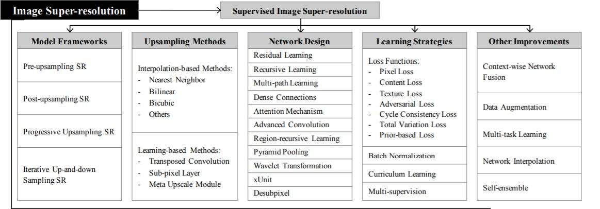
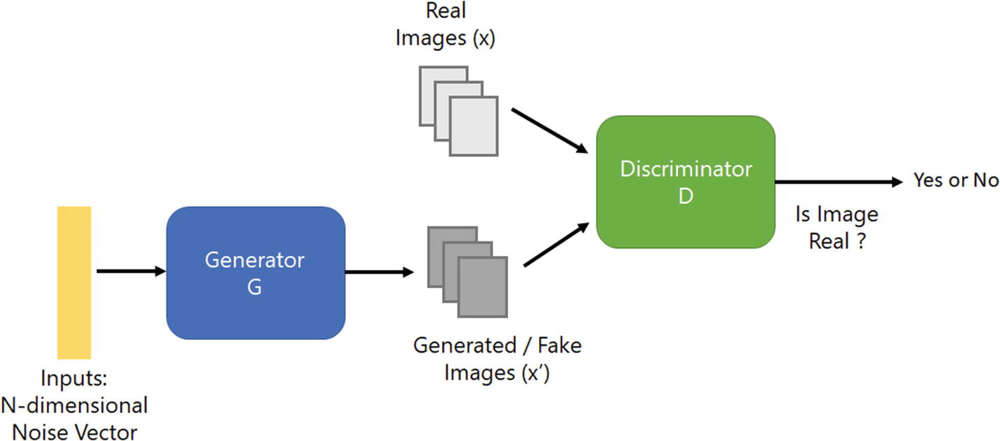
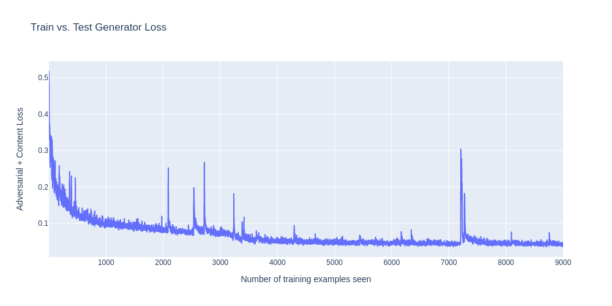
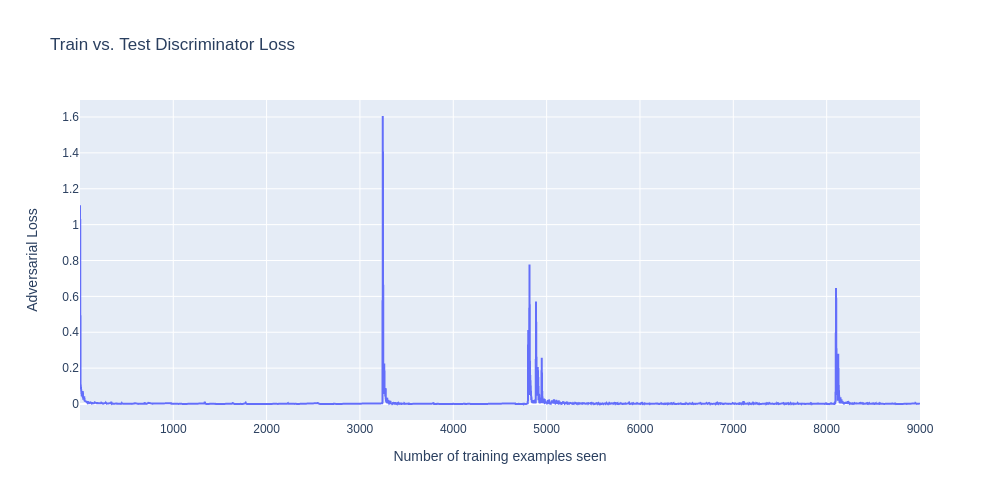

# Image Super-Resolution

## THEORY

- Image super-resolution (SR) is the process of recovering high-resolution (HR) images from low-resolution (LR) images.
- It is an important class of image processing techniques in computer vision and image processing and enjoys a wide range of real-world applications, such as medical imaging, satellite imaging, surveillance and security, astronomical imaging, amongst others.
- With the advancement in deep learning techniques in recent years, deep learning-based SR models have been actively explored and often achieve state-of-the-art performance on various benchmarks of SR.
- A variety of deep learning methods have been applied to solve SR tasks, ranging from the early Convolutional Neural Networks (CNN) based method to recent promising Generative Adversarial Nets based SR approaches.

- Image super-resolution (SR) problem, particularly single image super-resolution (SISR), has gained a lot of attention in the research community.
- SISR aims to reconstruct a high-resolution image ISR from a single low-resolution image ILR.
- Generally, the relationship between ILR and the original high-resolution image IHR can vary depending on the situation. Many studies assume that ILR is a bicubic downsampled version of IHR, but other degrading factors such as blur, decimation, or noise can also be considered for practical applications.

<b>Exhaustive table of topics in Supervised Image Super-Resolution:</b>

#### Metrics

1. <b>MSE Loss</b>

MSE measures the average squared difference between the generated HR image and the ground truth HR image. To calculate the MSE for a set of N test images, we can use the following equation:

$MSE = (1/N)$ \* $\Sigma[(HR_i - GAN_i)^2]$

Here, $HR_i$ is the ground truth HR image, $GAN_i$ is the corresponding generated HR image by the SRGAN model, and the sum is taken over all N test images.

2. <b>SSIM (Structural Similarity Index)</b>

SSIM measures the structural similarity between the generated HR image and the ground truth HR image. To calculate the SSIM for a set of N test images, we can use the following equation:

$SSIM = (1/N) * \Sigma[SSIM_i]$

Here, $SSIM_i$ is the SSIM index for the ith test image, and the sum is taken over all N test images.

To calculate the SSIM index for a single image, we can use the following equation:

$SSIM_i = (2 * mu_x * mu_y + c1) * (2 * sigma_xy + c2) / ((mu_x^2 + mu_y^2 + c1) * (sigma_x^2 + sigma_y^2 + c2))$

Here, $mu_x$ and $mu_y$ are the mean values of the generated HR image and the ground truth HR image, $sigma_x$ and $sigma_y$ are the standard deviations of the generated HR image and the ground truth HR image, $sigma_xy$ is the cross-covariance of the generated HR image and the ground truth HR image, and c1 and c2 are constants to avoid numerical instability.

3. <b>PSNR (Peak Signal-to-Noise Ratio)</b>

PSNR measures the peak signal-to-noise ratio between the generated HR image and the ground truth HR image. To calculate the PSNR for a set of N test images, we can use the following equation:

$PSNR = (1/N) * \Sigma[PSNR_i]$

Here, $PSNR_i$ is the PSNR value for the $ith$ test image, and the sum is taken over all N test images.

To calculate the PSNR value for a single image, we can use the following equation:

$PSNR_i = 20 * log10(MAX_i) - 10 * log10(MSE_i)$

Here, $MAX_i$ is the maximum pixel value of the image (for example, 255 for an 8-bit image), and $MSE_i$ is the mean squared error for the $ith$ image.

## Approach

For this task I have used <b>SRGAN</b> (Super-Resolution Generative Adversarial Network) which uses the idea of GAN for super-resolution task i.e. generator will try to produce an image from noise which will be judged by the discriminator. Both will keep training so that generator can generate images that can match the true training data.

Dataset with high and low resolution images were provided.

1. Since the dataset had two different subfolders containing HR and LR images, I have first mapped the LR images to their corresponding HR images and then divided them into train and test folders.
2. Images were in .npy format, so it was converted to .jpg by using opencv.
3. The architecture for the model is defined. First the feature extractor is defined which is used for perceptual loss as this model works on comparing the feature maps formed by the VGG model.
4. Then Generator and Discriminator blocks are defined. Generator is a deconvolutional block which upsamples the image while Discriminator is a convolutional block which downsamples the image.
5. The output from the generator block is fed to the discriminator block.
6. Generator job is to create a real image while the Discriminator job is to detect whether the input image from the generator is a real or fake image.
7. The model is trained for 1 epoch.
8. MSE, PSNR and SSIM are calculated after training.

## Results

### Metrics

1. <b>MSE</b>: 0.0007601894683612045
2. <b>SSIM</b>: 0.8340342856645584
3. <b>PSNR</b>: 32.14627635524643

### References

[Photo-Realistic Single Image Super-Resolution Using a Generative Adversarial Network](https://arxiv.org/pdf/1609.04802.pdf)
